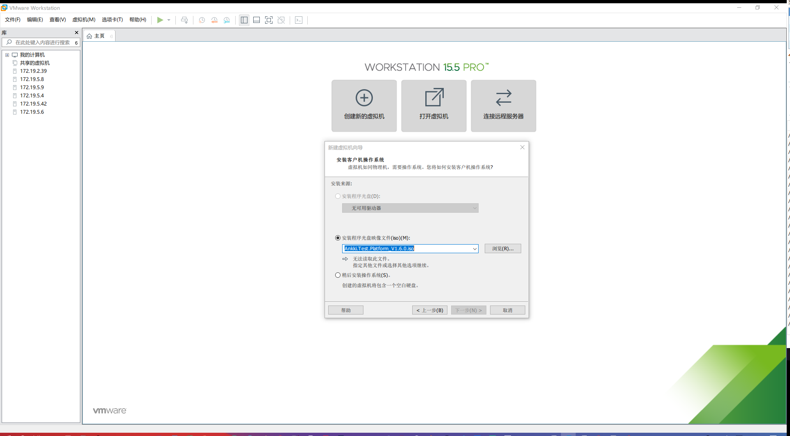
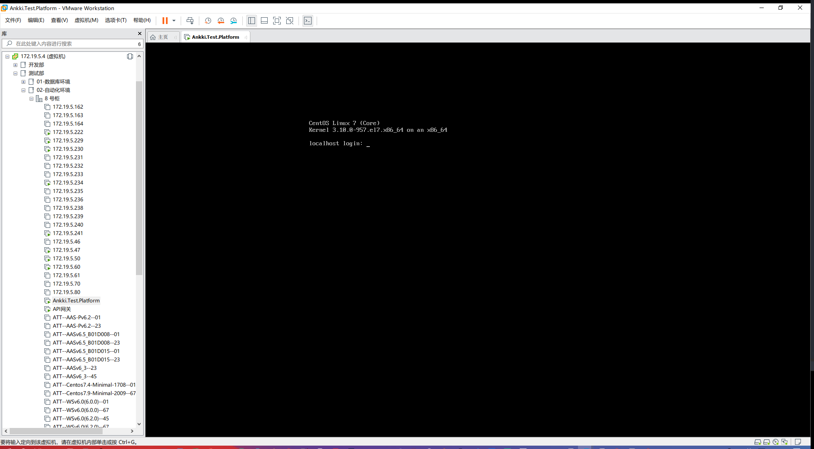
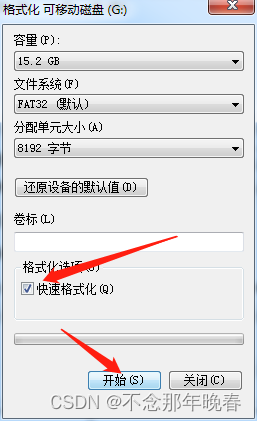
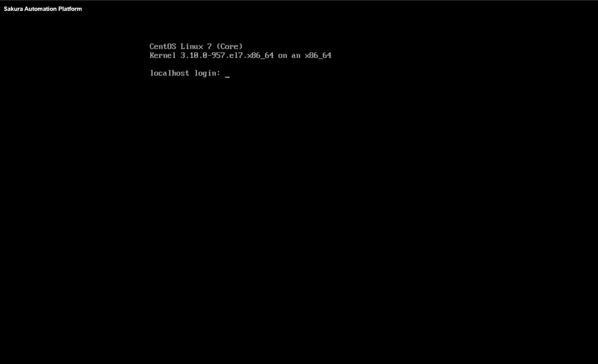
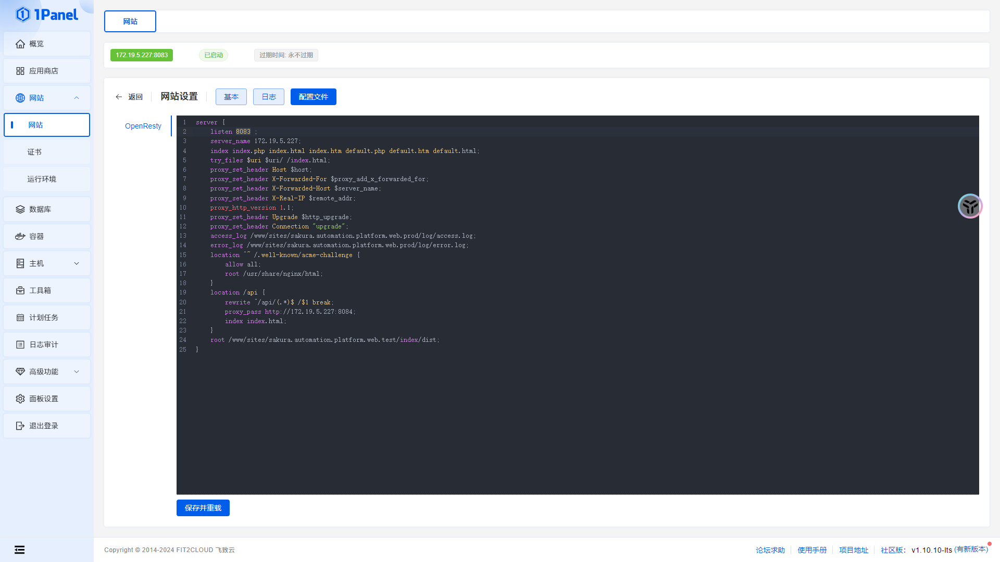

# 快速开始

## 环境准备

### 服务器要求

准备一台服务器（虚拟机，实体机，阿里云，腾讯云，华为云）都可以，要求如下：

:::tip
公司部署使用，推荐内部虚拟机或实体机服务器，可以通过内网访问，速度相对较快，没有带宽限制

个人部署使用，推荐阿里云，腾讯云，华为云等，可以通过外网访问，速度相对较慢，会有带宽限制
:::

- CPU：4核或8核（推荐 8核）
- 内存：8G或16G（推荐 16G）
- 硬盘：200G或400G（推荐系统盘200G + 数据盘200G）
- 网络：可访问互联网

### ISO 镜像下载

- [点击下载](http://172.19.5.227:8079/Sakura.Automation.Platform/iso/Sakura.Automation.Platform_V1.6.0.iso)

### ISO 镜像制作

推荐使用Mondo Rescue进行Linux系统镜像制作，可进行备份和还原。

- 官方地址：[点击访问](http://www.mondorescue.org/)
- 使用教程：[点击访问](https://www.cnblogs.com/safe-rabbit/p/17550182.html)


## 虚拟机部署

### 安装教程

推荐使用VMware Workstation，下载最新版本，采用默认设置安装即可。

- 官方地址：[点击访问](https://www.vmware.com/products/workstation-pro/workstation-pro-evaluation.html)
- 官方教程：[点击访问](https://www.vmware.com/support/ws55/doc/ws_new_install.html)

### 创建虚拟机

- 启动虚拟机，创建新的虚拟机，采用镜像安装方式，选择下载ISO镜像文件。

- 指定虚拟机名称和安装位置。

- 设置磁盘容量大小。

- 完成创建。


### 启动虚拟机

完成创建虚拟机后，启动该虚拟机，使用默认账号和密码进入系统。

:::tip

- 账号：root
  
- 密码：3edc$RFV
  
:::


## 实体机部署

### 软件下载

推荐使用UltraISO，下载最新版本，采用默认设置安装即可。

- 官方地址：[点击访问](https://cn.ultraiso.net/xiazai.html)
- 官方教程：[点击访问](https://cn.ultraiso.net/jiaochengzhongxin.html)

### U盘启动

- 双击打开UltraISO，点击文件->打开->选择下载好的ISO文件->打开。

- 点击启动->写入硬盘映像。(写入方式建议使用USB-HDD+，隐藏启动分区选 无)。

- 选择对应U盘，进行格式化，点击开始

- 点击开始，弹出数据将格式化警告，确定后开始写入

- 点击写入，选择是，耐心等待写入完成，制作成功！


- 把U盘插到服务器，设置开机U盘启动，输入nuke，回车。

- 自动恢复中，等待恢复完成


- 恢复完成后，输入exit，重启系统。

- 使用默认账号和密码进入系统。

:::tip

- 账号：root
  
- 密码：3edc$RFV
  
:::


## 修改IP地址

进入系统后，修改IP地址，然后重启网络。
:::tip
修改前请先ping一下IP地址，确保该IP地址可用，且未被其他人使用，不然会IP冲突。
:::

```bash
# 修改IP地址
vi /etc/sysconfig/network-scripts/ifcfg-ens192

# 参考以下配置
TYPE=Ethernet
PROXY_METHOD=none
BROWSER_ONLY=no #默认是yes，修改为no
BOOTPROTO=static # 默认是dhcp，修改为static
DEFROUTE=yes
IPV4_FAILURE_FATAL=yes # 默认是no，修改为yes
IPV6INIT=yes
IPV6_AUTOCONF=yes
IPV6_DEFROUTE=yes
IPV6_FAILURE_FATAL=no
IPV6_ADDR_GEN_MODE=stable-privacy
NAME=ens192
UUID=6280f4db-5773-4760-b83c-e5fc57cc086c
DEVICE=ens192
ONBOOT=yes  # 默认是no，修改为yes
IPADDR=172.19.5.227 # 修改为你的IP地址，没有就新增
GATEWAY=172.19.5.1  # 修改为你的网关，没有就新增
NETMASK=255.255.255.0 # 修改为你的子网掩码，没有就新增
DNS1=114.114.114.114 # 修改为你的DNS，没有就新增
ZONE=public

# 重启网络
service network restart
```

## 站点配置

:::tip

默认已经安装好1Panel面板并创建好前端访问站点，可直接使用，详情请进入1Panel网站面板查看

- 地址：https://172.19.5.227:32487/3eb582a0 （地址中的IP请改为你的服务器IP）
- 账号：root
- 密码：3edc$RFV
- 路径：打开左侧网站菜单，选择PHP项目，修改Sakura.Automation.Platform.web.test配置文件

```bash
# 参考以下配置
server
{
    listen 8083;
    server_name sakura.automation.platform.web.test;
    index index.php index.html index.htm default.php default.htm default.html;
    root /data/sakura/Sakura.Automation.Platform/web/origin/test/dist;
    try_files $uri $uri/ /index.html;
    
    #CERT-APPLY-CHECK--START
    # 用于SSL证书申请时的文件验证相关配置 -- 请勿删除
    include /www/server/panel/vhost/nginx/well-known/sakura.automation.platform.web.test.conf;
    #CERT-APPLY-CHECK--END

    #SSL-START SSL相关配置，请勿删除或修改下一行带注释的404规则
    #error_page 404/404.html;
    #SSL-END

    #ERROR-PAGE-START  错误页配置，可以注释、删除或修改
    #error_page 404 /404.html;
    #error_page 502 /502.html;
    #ERROR-PAGE-END

    #PHP-INFO-START  PHP引用配置，可以注释或修改
    include enable-php-80.conf;
    #PHP-INFO-END

    #REWRITE-START URL重写规则引用,修改后将导致面板设置的伪静态规则失效
    include /www/server/panel/vhost/rewrite/sakura.automation.platform.web.test.conf;
    #REWRITE-END

    #禁止访问的文件或目录
    location ~ ^/(\.user.ini|\.htaccess|\.git|\.env|\.svn|\.project|LICENSE|README.md)
    {
        return 404;
    }

    #一键申请SSL证书验证目录相关设置
    location ~ \.well-known{
        allow all;
    }

    #禁止在证书验证目录放入敏感文件
    if ( $uri ~ "^/\.well-known/.*\.(php|jsp|py|js|css|lua|ts|go|zip|tar\.gz|rar|7z|sql|bak)$" ) {
        return 403;
    }

    #过滤相关图片文件
    # location ~ .*\.(gif|jpg|jpeg|png|bmp|swf)$
    # {
    #     expires      30d;
    #     error_log /dev/null;
    #     access_log /dev/null;
    # }

    location ~ .*\.(js|css)?$
    {
        expires      12h;
        error_log /dev/null;
        access_log /dev/null;
    }
    
    location /api{
        rewrite  ^/api/(.*)$ /$1 break;
        proxy_pass   http://localhost:8084;
        index index.html;
    }
    
    access_log  /www/wwwlogs/sakura.automation.platform.web.test.log;
    error_log  /www/wwwlogs/sakura.automation.platform.web.test.error.log;
}
```

:::


## 访问域名

客户端通过浏览器访问以下地址，输入默认账号和密码，即可开始使用。
:::tip

- 地址: http://172.19.5.227:8083（地址中的IP请改为你的服务器IP）
- 账号：管理员
- 密码：111111
- 可自己注册账号使用

:::
