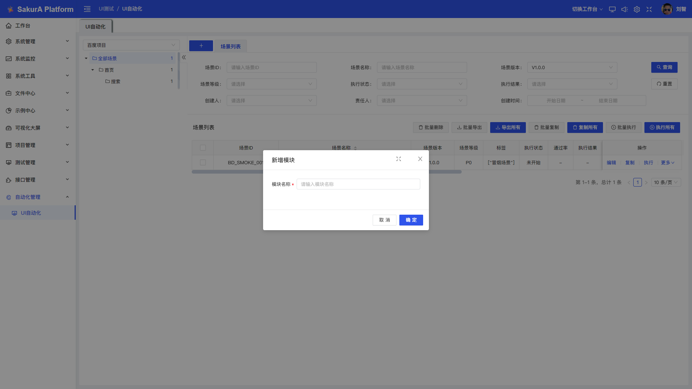
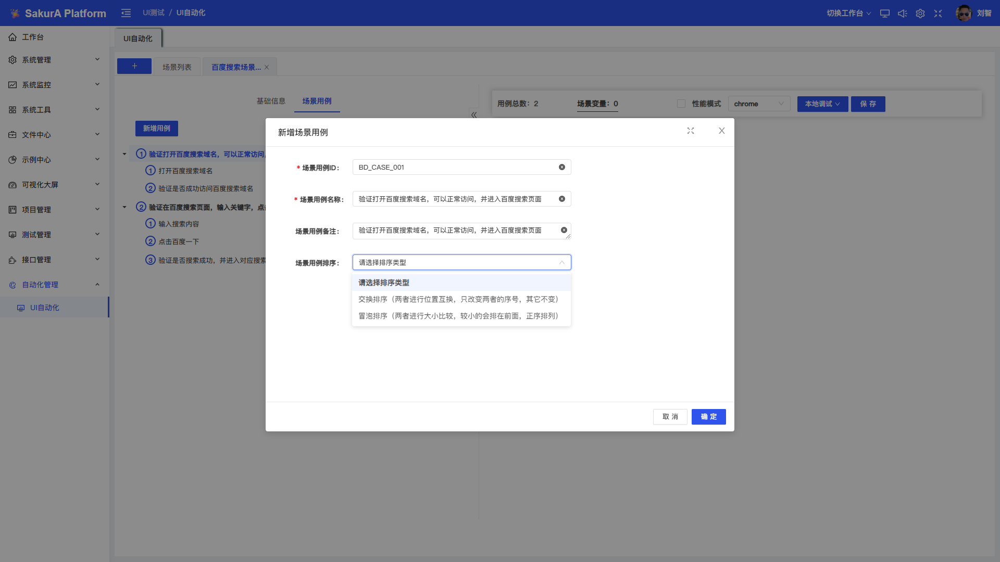
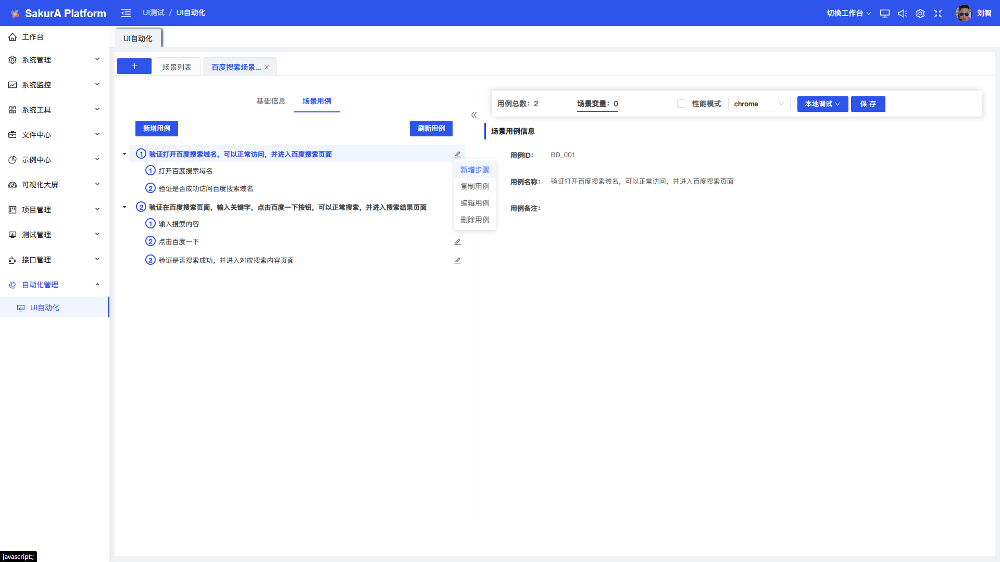
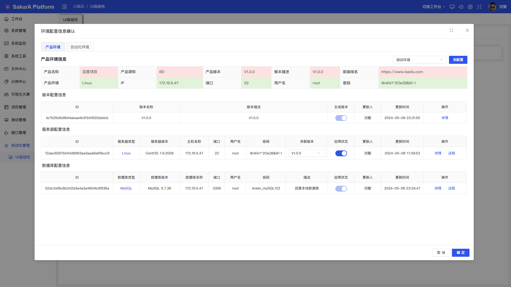
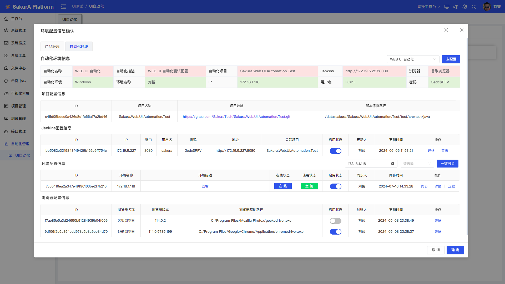
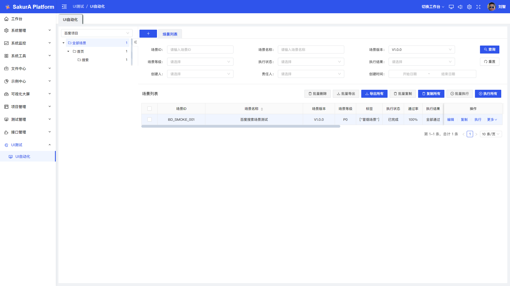
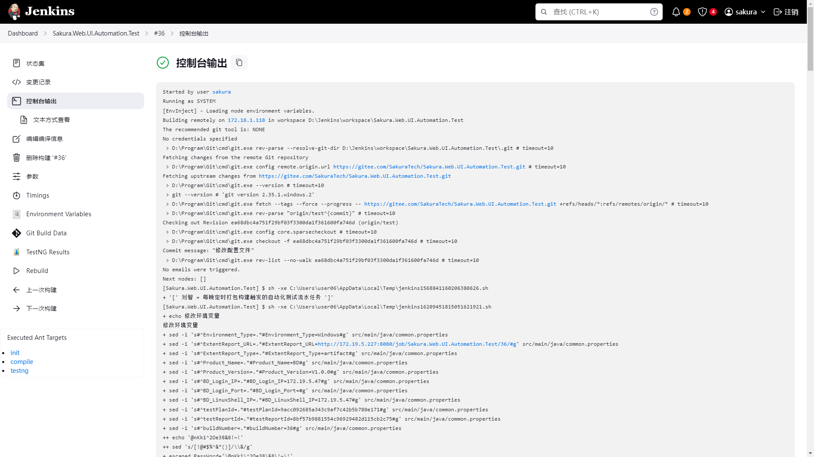
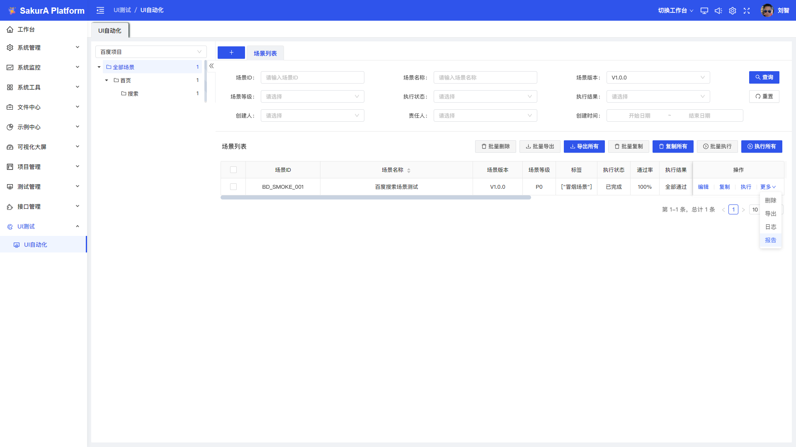
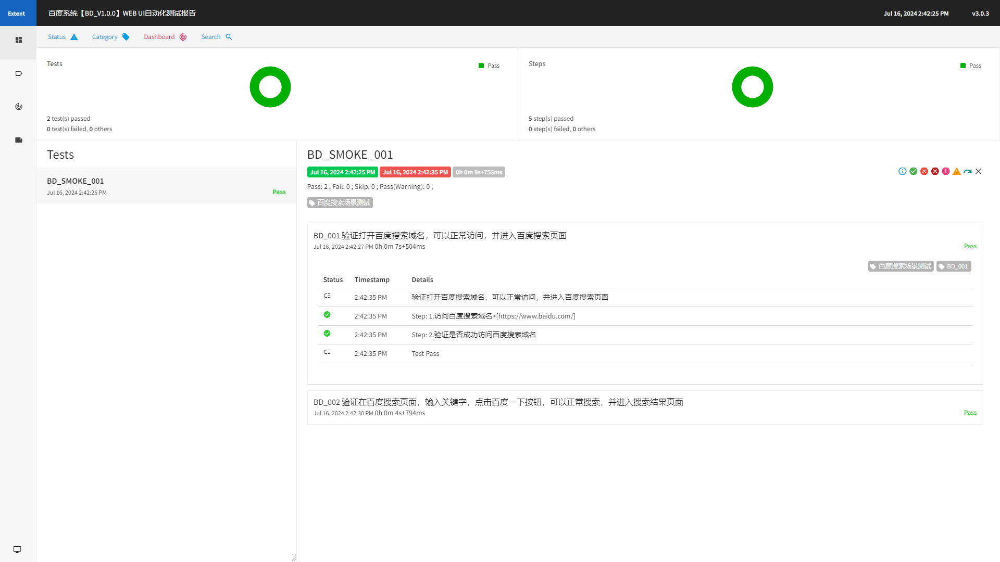

# UI自动化

## 新建场景模块

- 适用角色：所有人员
- 操作步骤：进入【自动化管理-UI自动化】，点击左侧目录【新增模块】，添加对应测试场景模块结构，即可
  
:::tip

- 请根据全部场景=>一级功能=>二级功能=>三级功能=>四级功能等结构，创建对应场景模块，例如：
  - 全部场景
    - 首页
      - 搜索

:::

## 新建测试场景

- 适用角色：所有人员
- 操作步骤：进入【自动化管理-UI自动化】，选择对应项目和版本，点击右上方【新建场景】，进入添加页面

### 基础信息

:::tip

- 选择填写对应测试场景基础信息，保存即可，如下：
  - 场景ID：填写测试场景ID，例如：BD_SMOKE_001
  - 场景名称：填写测试场景名称，例如：百度搜索场景测试
  - 所属项目：选择所属项目，默认为即可
  - 所属版本：选择所属版本，例如：V1.0.0
  - 所属模块：选择所属模块，例如：搜索
  - 场景等级：选择场景等级，例如：P0
  - 执行状态：选择场景执行状态，默认为未开始
  - 责任人：选择场景责任人，例如：刘智
  - 标签：选择场景标签，例如：冒烟测试场景
  - 描述：填写场景描述，例如：百度搜索场景测试

:::

### 场景用例

> 新增用例

:::tip

- 新增对应场景用例，点击【新增用例】，即可进入新增页面，如下：
  - 场景用例ID：填写测试场景ID，例如：
    - BD_CASE_001
  - 场景用例名称：填写场景用例名称，例如：
    - 验证打开百度搜索域名，可以正常访问，并进入百度搜索页面
  - 场景用例备注：填写场景用例备注，例如：
    - 验证打开百度搜索域名，可以正常访问，并进入百度搜索页面
  - 场景用例排序：选择场景用例排序，根据需要可进行排序，默认为顺序排列
  
:::

> 新增步骤

:::tip

- 选择对应场景用例，点击左侧编辑按钮，选择【新增步骤】，即可进入新增页面，如下：
  - 步骤名称：填写步骤名称，例如：
    - 打开百度搜索域名
  - 步骤排序：选择场景用例排序，根据需要可进行排序，默认为顺序排列
  - 操作类型：选择对应操作类型，例如：
    - 浏览器操作
  - 操作方法：选择对应操作类型，例如：
    - 打开指定网页
  - 操作步骤：填写对应操作步骤，例如：
    - value：https://172.19.5.47/login
  
:::

### 用例调试

> 选择调试类型
:::tip

- 用例调试分为本地调试和远程调试两种方式，如下：
  - 本地调试：选择本地调试，则会使用本地自动化环境调试，需要配置本地自动化环境
  - 远程调试：选择远程调试，则会使用远程自动化环境调试，需要配置远程自动化环境
  - 查看日志：选择查看日志，则会跳转至对应运行日志页面
  - 查看报告：选择查看报告，则会跳转至对应测试报告页面
  
:::

> 确认环境配置信息
:::tip

- 用例调试，需要确认环境配置信息，根据选择的环境配置信息对应展示，如下：
  - 产品环境配置：
    - 产品名称：对应项目配置中的项目名称，例如：百度项目
    - 产品简称：对应项目配置中的项目简称，例如：BD
    - 产品版本：对应环境配置-版本配置中的版本名称，例如：V1.0.0
    - 版本描述：对应环境配置-版本配置中的版本描述，例如：V1.0.0
    - 前端域名：对应环境配置-服务器配置-参数配置中的前端域名，例如：https://www.baidu.com
    - 产品环境：对应环境配置-服务器配置中的服务器类型，例如：Linux
    - IP：对应环境配置-服务器配置中的主机名称，例如：172.19.5.47
    - 端口：对应环境配置-服务器配置中的主机端口，例如：22
    - 用户名：对应环境配置-服务器配置中的用户名，例如：root
    - 密码：对应环境配置-服务器配置中的密码，例如：@nKk1^2Oe38&8!~!
  
:::

:::tip

- 自动化环境配置：
  - 自动化名称：对应自动化配置中的配置名称，例如：WEB UI 自动化
    - 自动化描述：对应自动化配置中的配置描述，例如：WEB UI 自动化测试配置
    - 自动化项目：对应自动化配置-项目配置中的项目名称，例如：Sakura.Web.UI.Automation.Test
    - Jenkins：对应自动化配置-Jenkins配置中地址，例如：http://172.19.5.227:8080
    - 浏览器：对应自动化配置-浏览器配置中浏览器名称，例如：谷歌浏览器
  - 自动化环境：对应自动化配置-环境配置中环境类型，例如：Windows
    - 环境名称：对应自动化配置-环境配置中环境名称，例如：刘智
    - IP：对应自动化配置-环境配置中环境名称，例如：172.18.1.118
    - 用户名：对应自动化配置-环境配置中用户名，例如：liuzhi
    - 密码：对应自动化配置-环境配置中密码，例如：3edc$RFV

:::

> 确认执行场景信息
:::tip

- 确认环境配置信息后，需要再次确认执行的场景信息，点击【确定】进入确认执行场景信息弹窗页面

:::

> 查看Jenkns执行日志
:::tip

- 确认好执行场景信息，点击【确定】等待10秒后，会自动进入Jenkins执行页面，并输出运行日志信息

:::

### 查看结果

> 查看同步测试结果
:::tip

- 等待测试场景执行完毕后，会自动同步最新的测试结果，包含执行状态，通过率，执行结果，运行耗时

:::

> 查看邮件测试报告
:::tip

- 等待Jenkins执行完毕后，会自动发送相关测试报告到当前用户配置的邮箱地址中，详情可查看邮件

:::

> 查看运行日志
:::tip

- 等待测试场景执行完毕后，点击【操作-更多-日志】，即可在线查看运行日志，如下：

:::

> 查看测试报告
:::tip

- 等待测试场景执行完毕后，点击【操作-更多-报告】，即可在线查看测试报告，如下：

:::

